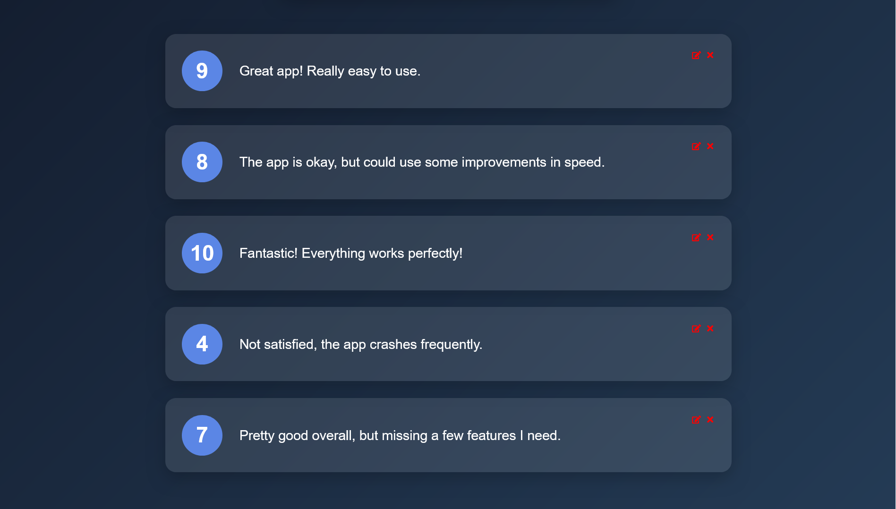

# Feedback App

This is a feedback collection application built using React.js. Users can submit their feedback, rate their experience, and view an aggregate of the feedback provided by others. This project showcases component-based architecture, state management, and API simulation. And the users can edit or delete their feedback.

## Screens

The app consists of the following screens:

1. **Feedback App Main Screen**:
   

2. **Feedback App List Screen**:
   

## Features

- Submit feedback with a rating between 1 and 10
- View a list of all feedback provided
- Edit or delete your feedback
- Display aggregate statistics such as average rating
- Simulate API functionality with local data

## Project Structure

The app consists of the following components:

- **App.jsx**: The main component that handles the state of the entire app.
- **Header.jsx**: Displays the app title.
- **FeedbackForm.jsx**: Allows users to submit their feedback and rating.
- **FeedbackList.jsx**: Displays the list of feedback items.
- **FeedbackItem.jsx**: Represents a single feedback item.
- **FeedbackStats.jsx**: Shows aggregate statistics like the total number of feedback entries and the average rating.
- **RatingSelect.jsx**: Provides a rating selection component for users.
- **Button.jsx**: A reusable button component.
- **FeedbackContext.jsx**: Contain all global function and props in the app.
- **feedbackApi.js**: Simulates an API response with local data.

## Usage

- Start the application using npm start.
- Add your feedback by entering text and selecting a rating.
- View all feedback entries and aggregate statistics in real-time.

## Technologies Used

- React.js
- JavaScript (ES6+)
- CSS
- HTML5

## Installation

1. Clone the repository:
   ```bash
   git clone https://github.com/MoSalem149/feedback-app-react.git
   ```
